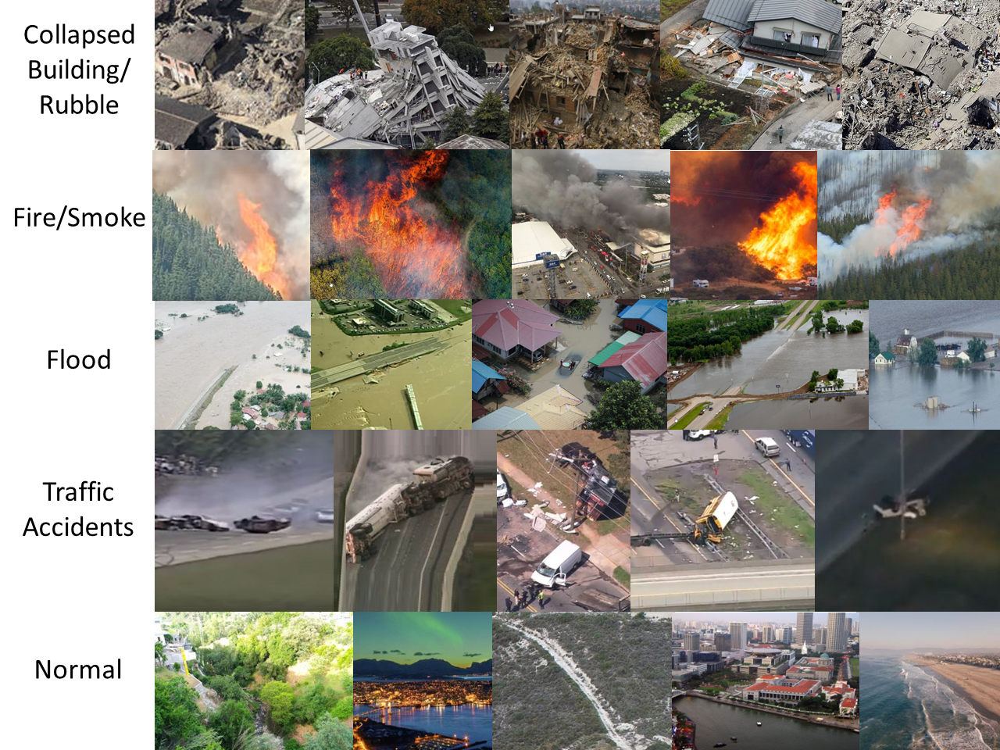

# AIDER:  Aerial Image Database for Emergency Response Applications

## Overview
**Notice**
*UNDER CONSTRUCTION*
*Preliminary Dataset: This Dataset is preliminary, an extented version will be uploaded soon.*

###### This repo containts only the AIDER dataset, for the deep convolutional neural network called EmergencyNet that is trained on this dataset plase see this [repo]()

The dataset construction involved manually collecting all images for four disaster events Fire/Smoke, Flood, Collapsed Building/Rubble, and for Traffic Accidents, as well as for normal case that does not signal the presence of a disaster.

The aerial images of these disaster classes were collected from multiple sources such as the world-wide-web (e.g. google images, bing images, youtube, news agencies web sites, etc.), other databases of general aerial images, and images collected using our own UAV platform. During the data collection process the various disaster events were captured with different resolutions and under various condition with regards to illumination and viewpoint.

It is advised to further enhance the dataset that random augmentations are probabilistically applied to each image prior to adding it to the batch for training. Specifically there are a number of possible transformations such as geometric (rotations, translations, horizontal axis mirroring, cropping and zooming), as well as image manipulations (illumination changes, color shifting, blurring, sharpening, and shadowing).

Snapshot of some of the images below:

**This dataset is released for non-commercial/academic use only**

## Citation Information

** C.Kyrkou, T.Theocharides "Deep-Learning-Based Aerial Image Classification for Emergency Response Applications using Unmanned Aerial Vehicles", Computer Vision and Pattern Recognition Workshops,  3rd International Workshop on Computer Vision for UAVs (UAVision 2019), Long Beach, CA, 16-20 June, 2019 [pdf📜 ](http://openaccess.thecvf.com/content_CVPRW_2019/papers/UAVision/Kyrkou_Deep-Learning-Based_Aerial_Image_Classification_for_Emergency_Response_Applications_Using_Unmanned_CVPRW_2019_paper), [arxiv🗊](https://arxiv.org/abs/1906.08716), [video🎞](https://www.youtube.com/watch?v=prpyl893Ksc)
